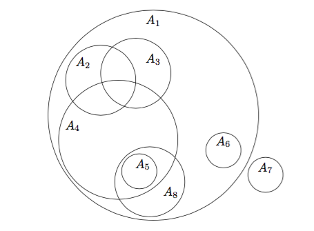
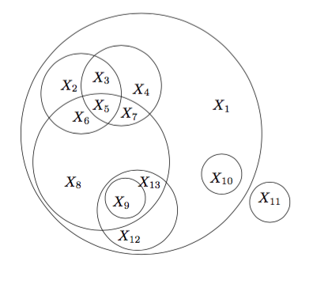
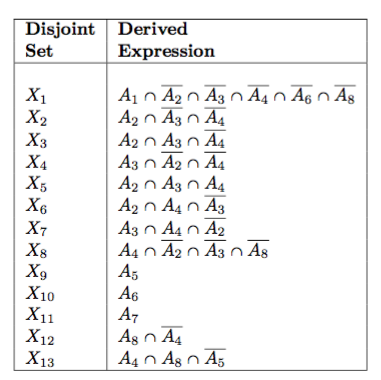

# LISP-TYPES

## Synopsis

Utilities dealing with CL types

## API

### Typecase API

* `bdd-typecase` -- Syntactically similar to `CL:TYPECASE`. Expands to
`BLOCK`/`TAGBODY`/`IF`/`GO` idiom assuring that no type check occurs
more than once.  This is done by converting the typcase expression
to an ROBDD, and serializing the ROBDD.

```lisp
(bdd-typecase obj
  (float 41)
  ((and number (not float)) 42))
```


* `reduced-typecase` --   Syntactically similar to `CL:TYPECASE`. Expands to a call to `CL:TYPECASE` but
with cases reduced if possible.  In particular latter cases assume that previous
cases have failed.  This macro preserves the order of the clauses, but is
likely to change the executable logic (preserving semantics) of the test
of each clause. E.g.,

```lisp
(reduced-typecase obj
  (float 41)
  ((and number (not float)) 42))
```

Because if clause 2 is reached, it is known that obj is not a `FLOAT`, so this expands to

```lisp 
(typecase obj
    (float 41)
    (number 42))
```

There may be cases when a type specifier reduces to `nil`, in which case the
compiler may issue warnings about removing unreachable code."

* `auto-permute-typecase` --  Syntactically similar to `CL:TYPECASE`. Expands to a call to `CL:TYPECASE` but
with the types reduced and re-ordered to minimize a projected cost
heuristic function.  Semantics of the typecase is preserved.


### MDTD functions

MDTD = Maximal Disjoint Type Decomposition.  The problem entails taking a set V={A<sub>1</sub>, A<sub>2</sub>, ... A<sub>n</sub>} of sets (set of types)
which are possibly overlapping each other...



... and decomposing them into a disjoint sets D={X<sub>1</sub>, X<sub>2</sub>, ... X<sub>m</sub>} of such
that the union of all the A's is the same as the union of all the X's.





Each X<sub>i</sub> should be expressed as some Boolean combination of A<sub>1</sub> ... A<sub>n</sub>.




The functions described here are all implementations of the same MDTD procedure.
The algorithms differ considerably in their actual impelementations.  The details of the differences are described
in the [PhD thesis](https://www.lrde.epita.fr/wiki/User:Jnewton).


* `mdtd-baseline` --  Given a list `TYPE-SPECIFIERS` of lisp type names, return a list of disjoint, 
non-nil type-specifiers comprising the same union, with each of the resulting
type-specifiers being a sub-type of one of the given type-specifiers.
This implementation of MDTD uses an n-cube search over the given list of
type specifiers searching for intersecting types, disjointing them, and 
continuing the search until all intersections are exhausted.  Type manipulation
is done using s-expressions and type reduction via `type-to-dnf`. This algorithm
is simple programmatically, but known to be poorly performing, in most cases.

* `mdtd-bdd` -- Very similar to `mdtd-baseline` except that type
specifiers are represented as ROBDDs using the CL-ROBDD package, and
the `lisp-type-bdd` class.

* `mdtd-rtev2` -- A tweak of `mdtd-bdd` which attempts to reduce the
complexity, but in some cases it performs worse.

* `mdtd-graph` -- MDTD implementation which uses a hierarchy graph of
the types to keep track of which types intersect other types, and thus
avoid attempting to find the intersection of types which are known to
not intersect.  This algorithm uses s-expressions to represent type
specifiers.

* `mdtd-bdd-graph` -- Similar to `mdtd-graph` but using BDDs as type
representation data structure.

* `mdtd-bdd-graph-strong` -- Similar to `mdtd-bdd-graph` but uses the
default hash table to store the BDD forest.

* `mdtd-bdd-graph-weak` -- Similar to `mdtd-bdd-graph` but uses a weak
hash table to store the BDD forest.

* `mdtd-bdd-graph-weak-dynamic` -- Similar to `mdtd-bdd-graph` but
uses a weak hash table to store the BDD forest.  This algorithm
improves on `mdtd-bdd-graph-weak` by decreasing the number of types
the hash table is purged.  The hash table is maintained in a higher
level dynamic extend than in the `mdtd-bdd-graph-weak` function.

* `mdtd-bdd-strong` -- Similar to `mdtd-bdd` but using BDDs as type
representation data structure.

* `mdtd-bdd-weak` -- Similar to `mdtd-bdd` but uses the default hash
table to store the BDD forest.

* `mdtd-bdd-weak-dynamic` -- Similar to `mdtd-bdd` but uses a weak
hash table to store the BDD forest.  This algorithm improves on
`mdtd-bdd-weak` by decreasing the number of types the hash table is
purged.  The hash table is maintained in a higher level dynamic extend
than in the `mdtd-bdd-weak` function.

* `mdtd-graph-baker` -- Similar to `mdtd-graph` but uses the BAKER
algorithm rather than `cl:subtypep`.

* `mdtd-sat` -- A simple ad-hoc SAT solver approach which simply
iterates over every possible Boolean combination of all the given
types and their complemnts.  This algorithm has suprisingly good
performance on small test cases, but is generally the worst performing
in general.

* `parameterized-mdtd-bdd-graph` -- A very generalized version of
`mdtd-bdd-graph` which was used to find which variants of the
algorithm work best.

### ROBDD API

* `ltbdd` -- Factory function to create an ROBDD object whose Boolean
variables represent Common Lisp types, understanding subtype
relations.  The BDD algebra functions may be used on these objects
such as `bdd-and`, `bdd-or` etc.  See
[cl-robdd](../cl-robdd/README.md).  The function `ltbdd` differs from
the function `bdd` in that `bdd` understands all Boolean variables to
be independent, assigning no particular semantics to labels.  In
particular variable names such as 'integer' and 'string' have no
special menaing.  With the function, `ltbdd`, however, labels are
interpreted as type specifiers.  Thus the expression `(and string
number)` is understood to be the empty type `nil`, and '(or fixnum
number)` is understood to be the same type as 'number`.

* `ltbdd-with-new-hash` -- macro -- Create a cache and dynamic extent
used to evaluate the given code body.  The ROBDDs representing Common
Lisp type specifiers created in this dynamic extent use this cache.

```lisp
PKG> (ltbdd-with-new-hash ()
       (bdd-to-dnf (bdd-and (bdd-xor (ltbdd '(and string vector))
                                     (ltbdd '(or ratio integer)))
                            (bdd-or (ltbdd 'array)
                                    (ltbdd 'number)))))
==> (OR STRING INTEGER RATIO)
```

### Subtype API

* `smarter-subtypep` -- A somewhat smarter version of `cl:subtypep`
which fixes some of the shortcomings of SBCL's `cl:subtypep`.

* `*subtypep*` -- Special variable containing the subtypep function,
normally this is the `#'CL:subtypep` function object, but can be an
alternative function such as `#'baker:subtypep`

* `subtypep-wrapper` -- Behaves like `CL:subtypep` but calls
`*subtypep`.  Functions using this interface to `subtypep` can be
made to use an alternate version such as `baker:subtypep` for
testing, by rebinding `*subtypep`.

* `caching-types` -- Evaluate the given body with several subtype-related caches enabled.

### Type simplification API
* `reduce-lisp-type` -- Given a common lisp type designator such as `(AND A (or (not B) C))`, apply some
algebraic manipulations to reduce the expression to a cannonical form.  The general
cannonical form is an OR of ANDs such as `(OR A (not B) (AND C (not D)))`, but may
be even simpler in cases such as `(OR A B)`, or `(AND A B)`.  A few restrictions apply:
1. OR never appears with an AND block
2. neither AND nor OR appear inside a NOT block
3. OR never has fewer than 2 operands
4. AND never has fewer than 2 operands.

* `bdd-reduce-lisp-type` -- simplfy the type specifier by converting
it to a bdd and then deserializing via `BDD-TO-DNF`

### Type API using BDDs

* `bdd-disjoint-types-p` -- Given two BDDs representing lisp type
specifiers, determine their intersection is empty.

* `bdd-empty-type` -- Given a BDDs representing a lisp type specifier,
determine if represents the empty type.

* `bdd-subtypep` -- Given two BDDs representing lisp type specifiers,
determine if the first is a subtype of the second.

* `bdd-type-equal` -- Given two BDDs representing lisp type
specifiers, determine if the types are equivalent.

### Other API

* `disjoint-types-p` -- Determine whether two types are disjoint,
i.e., is their interseciton is empty?

* `equivalent-types-p` -- Determine whether two types are equivalent
by asking whether each is a subtype of the other.  The subtype
relation is determined by `smarter-subtypep`.

* `remove-subs` -- Given a list of types, return a new list with with
all elements removed which specifies a subtype of something else in
the list.  If the list contains two elements which specify the same
type, only one of them is removed, unless it is a subtype of something
else in the list in which case both are removed.

* `remove-supers` -- Given a list of types, return a new list with
with all elements removed which specifies a supertype of something
else in the list.  If the list contains two elements which specify the
same type, only one of them is removed, unless it is a supertype of
something else in the list in which case both are removed.

* `valid-type-p` -- Predicate to determine whether the given object is
a valid type specifier.

    

## Code Examples

### DISJOINT_TYPES-P
```lisp
  (assert-true (equal '(nil t) (multiple-value-list (disjoint-types-p 'number '(not float)))))
  (assert-true (equal '(nil t) (multiple-value-list (disjoint-types-p '(not float) 'number))))
  (assert-true (equal '(t t) (multiple-value-list (disjoint-types-p '(not number) 'float))))
  (assert-true (equal '(t t) (multiple-value-list (disjoint-types-p 'float '(not number)))))
```

### SMARTER-SUBTYPEP
```lisp
  (assert (equal '(t t) (smarter-subtypep '(eql :x) 'keyword)))
  (assert (equal '(t t) (smarter-subtypep '(not keyword) '(not (eql :x)))))
  (assert (equal '(nil t) (multiple-value-list (smarter-subtypep 'keyword '(eql :x)))))
  (assert (equal '(nil t) (multiple-value-list (smarter-subtypep '(not keyword) '(eql :x)))))
  (assert (equal '(nil t) (multiple-value-list (smarter-subtypep '(not (eql :x)) 'keyword))))
```
### MDTD-BASELINE
```lisp
  (mdtd-baseline '(float integer bignum string seqeunce))
==>
  (string
   (and sequence (not string))
   bignum
   (and integer (not bignum))
   float)
```

### REDUCE-LISP-TYPE
```lisp
  (assert (equal (REDUCE-LISP-TYPE '(array (and integer number) (3)))
                      '(array integer (3))))
  (assert (equal (REDUCE-LISP-TYPE '(array * (3)))
                      '(array * (3))))

  ;; base-string
  (assert (equal (REDUCE-LISP-TYPE '(base-string *))
                      'base-string))

  ;; bit-vector
  (assert (equal (REDUCE-LISP-TYPE '(bit-vector *))
                      'bit-vector))

  (assert (equal (REDUCE-LISP-TYPE '(bit-vector 3))
                      '(bit-vector 3)))

  ;; complex
  (assert (equal (REDUCE-LISP-TYPE '(complex (and number real)))
                      '(complex real)))
  (assert (equal (REDUCE-LISP-TYPE '(complex *))
                      'complex ))

  ;; simple-array
  (assert (equal (REDUCE-LISP-TYPE '(simple-array (and number real) (3)))
                      '(simple-array real (3))))

  ;; vector
  (assert (equal (REDUCE-LISP-TYPE '(vector (and number real)))
                      '(vector real)))


  (assert (equal (REDUCE-LISP-TYPE '(cons (and float number) (or string (not string))))
                      '(cons float t)))
  (assert (equal (REDUCE-LISP-TYPE '(cons * *))
                      'cons))
  (assert (equal (REDUCE-LISP-TYPE '(cons (and float number) *))
                      '(cons float)))
  (assert (equal (REDUCE-LISP-TYPE '(cons * (and float number)))
                      '(cons * float)))

  (assert (equal (REDUCE-LISP-TYPE '(function (integer integer) integer))
                      '(function (integer integer) integer)))
  (assert (equal (REDUCE-LISP-TYPE '(function ((and integer integer) integer) integer))
                      '(function (integer integer) integer)))

  (assert (equal (REDUCE-LISP-TYPE '(function ((and integer integer) (and integer integer)) (and integer integer)))
                      '(function (integer integer) integer)))

  ;; test some optional arguments &optional &key &rest etc

  ;; &optional
  (assert (equal (REDUCE-LISP-TYPE '(function (&optional) (and list cons)))
                      '(function (&optional) cons)))

  (assert (equal (REDUCE-LISP-TYPE '(function (&optional (and integer number)) (and list cons)))
                      '(function (&optional integer) cons)))
  
  ;; &rest
  (assert (equal (REDUCE-LISP-TYPE '(function (&rest (and integer number)) (and list cons)))
                      '(function (&rest integer) cons)))


  ;; &key
  (assert (equal (REDUCE-LISP-TYPE '(function (&key) t))
                      '(function (&key) t)))

  (assert (equal (REDUCE-LISP-TYPE '(function (&key (x (and integer number))) (and list cons)))
                      '(function (&key (x integer)) cons)))

  ;; combining &optional &key &rest
  (assert (equal (REDUCE-LISP-TYPE
                       '(function ((and integer number)
                                   &optional (and integer number) (and integer number)
                                   &rest (and integer number)
                                   &key (x (and integer number)) (y (and integer number)))
                         (and list cons)))
                      '(function (integer
                                  &optional integer integer
                                  &rest integer
                                  &key (x integer) (y integer))
                        cons)))

```


## License

~~~~
Permission is hereby granted, free of charge, to any person obtaining
a copy of this software and associated documentation
files (the "Software"), to deal in the Software without restriction,
including without limitation the rights to use, copy, modify, merge,
publish, distribute, sublicense, and/or sell copies of the Software,
and to permit persons to whom the Software is furnished to do so,
subject to the following conditions:

The above copyright notice and this permission notice shall be
included in all copies or substantial portions of the Software.

THE SOFTWARE IS PROVIDED "AS IS", WITHOUT WARRANTY OF ANY KIND,
EXPRESS OR IMPLIED, INCLUDING BUT NOT LIMITED TO THE WARRANTIES OF
MERCHANTABILITY, FITNESS FOR A PARTICULAR PURPOSE AND
NONINFRINGEMENT. IN NO EVENT SHALL THE AUTHORS OR COPYRIGHT HOLDERS BE
LIABLE FOR ANY CLAIM, DAMAGES OR OTHER LIABILITY, WHETHER IN AN ACTION
OF CONTRACT, TORT OR OTHERWISE, ARISING FROM, OUT OF OR IN CONNECTION
WITH THE SOFTWARE OR THE USE OR OTHER DEALINGS IN THE SOFTWARE.
~~~~
